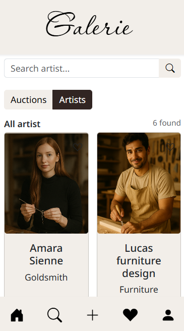
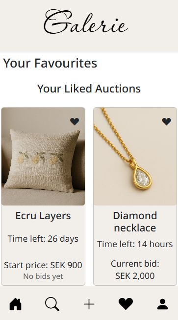

# Galerie

A modern auction marketplace for discovering artists and bidding on unique artworks and collectibles. 
Built with React and TypeScript on the frontend, powered by Orchard Core (.NET) on the backend.

## Features

- User authentication (sign up, login, logout)
- Browse auctions and artists
- Search and filtering
- Save favorites
- Become an artist and create auctions

## Tech Stack

- Frontend: React, TypeScript, Vite, SCSS
- Backend: Orchard Core (.NET)
- Database: SQLite


## Demo accounts for testing

- **Admin for Orchard backend:**  
  Username: `Tom`  
  Password: `Abcd1234!`

- **Customer:**  
  Username: `Mats`  
  Password: `Aaaa1111!`

- **Artist:**  
  Username: `Tindra`  
  Password: `Aaaa1111!`

## Screenshots

### Home Page
 
### Search Page Auction and Artist
  
 
### Favourites Page
 

## Installation

**Requirements:**
- Node.js 18+
- .NET SDK
- Git

**Setup:**
```bash
npm install
npm run restore
npm start
```

The application will be available at:
- Frontend: http://localhost:5173
- Backend API: http://localhost:5001

Press `Ctrl + C` to stop the application.

## Available Scripts

```bash
npm run restore  # Restore Orchard Core dependencies and seed data
npm run save     # Save Orchard Core configuration/state
```

## Troubleshooting

If you encounter issues after pulling updates, rerun the setup commands from the Installation section above.

## Planned Features
- Q&A for auctions
- Payment integration (Stripe)
- Live bidding with real-time updates
- Distance-based features (filtering by location, pickup locations, etc.)
